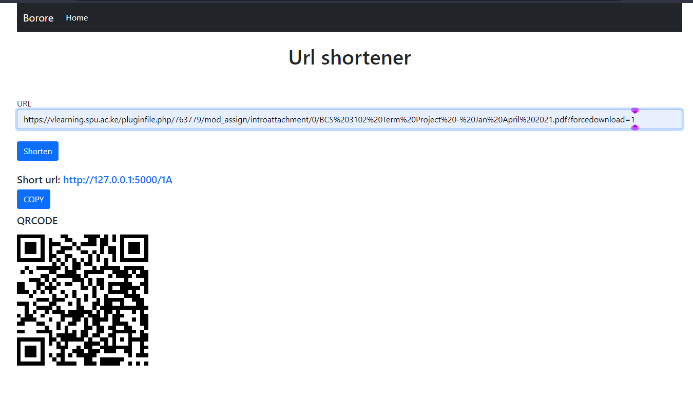

# url-shortner

URL shortener using flask and PostgreSQL🎉

[]

## how to run it

1. create virtual environment. **virtualenv env**

2. activate the *env* - __env\scripts\activate__

3. run **pip install -r requirements.txt**

4. run **python main.py**
